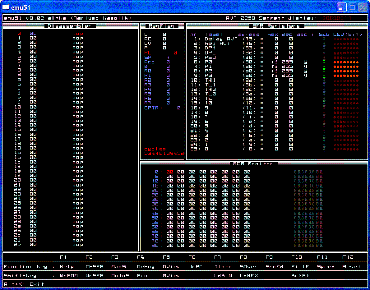

EMU51 
-----

Emu51 is a 80c51 emulator

### Informations

(from the original Readme file)

Emulator accepts `*.bin`, `*.hex` files. 
You can also compile source file by using external compiler, emu51 is compatible with  free 8051 compiler by 
MetaLink Corporation (http://www.metaice.com/ASM51/Files/ASM51.zip).
Just put asm51.exe into this directory and use Shift+F9 key combination to compile and load source file 
(only windows :-( ).
I'm still searching multiplatform 8051 assembler compiler for emu51, because I want to add full compilation 
support for all supported platforms.

The original version from Mariusz Kasolik and can be found here: https://emu51.sourceforge.net/
